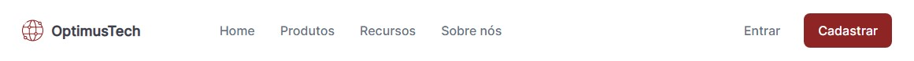

# 7 days Of Code - HTML e CSS - Alura

Esse repositório contêm minha solução para o desafio de 7 dias de HTML e CSS
da Alura.

## 📝 Licença

Esse repositório contêm a licença GPL-3.0, portanto não é permitido a
utilização desse código em projetos fechados. Projetos com código aberto podem
o utilizar com os devidos créditos. Para saber mais, [clique aqui](LICENSE).

## 🏃‍♂️ Progresso

### (19/04/2023)

**Tempo total:** aproximadamente 1h50min (15:14 → 17:07)

#### Commits

- ✨ Implement Header ([0b0badc](https://github.com/joaoiacillo/alura-7days-html-css/commit/0b0badcfe02c08d22ad931505507e11abdd6006c))

#### Resultados

Implementação do header como apresentado no design original, com animações
suaves e valores relativos.

